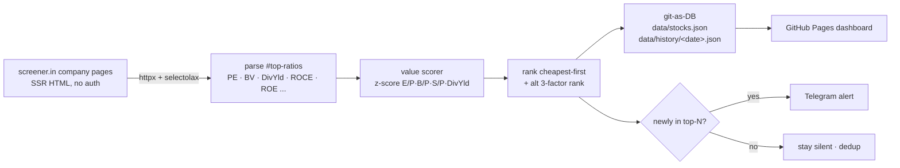

# oriz-screen-watch

[](https://github.com/chirag127/oriz-screen-watch/actions/workflows/test.yml)
[](https://github.com/chirag127/oriz-screen-watch/actions/workflows/scrape.yml)
[](https://github.com/chirag127/oriz-screen-watch/actions/workflows/deploy.yml)
[](LICENSE)
[](pyproject.toml)

**A [screener.in](https://www.screener.in) fundamentals + value-score tracker for a watchlist of Indian value stocks.** Scrapes the company ratio block for each tracked NSE ticker, computes a cross-sectional multi-factor **value score** (NSE Nifty500 Value 50 methodology), ranks the universe cheapest-first, and alerts on Telegram when a stock **newly enters the top-N** ("newly cheap"). State lives as JSON in git (git-as-DB); a static dashboard renders the ranked table.

> **Live dashboard:** https://chirag127.github.io/oriz-screen-watch/

## Data flow



## Features

- **Real screener.in fundamentals** — Market Cap, Current Price, Stock P/E, Book Value, Dividend Yield, ROCE, ROE, High/Low, Face Value (and Sales when the page exposes it). P/B derived from price / book value. Missing ratio = `null`, never fabricated.
- **Value score (Nifty500 Value 50 replica)** — factors E/P (1/PE), B/P (1/PB), S/P (sales/price), Dividend Yield → cross-sectional z-score each → equal-weight mean → `(1+z)` if z>0 else `1/(1−z)`. Higher = cheaper. Plus a **BSE-Enhanced-Value 3-factor** alternate ranking (drops dividend yield).
- **git-as-DB** — `data/stocks.json` (latest) + `data/history/<date>.json` (daily snapshot) committed each run; dedup so alerts fire only on change.
- **Telegram alerts (optional)** — pings when a stock crosses into the top-N value rank. Degrades gracefully without credentials.
- **Static dashboard** — sortable table (ticker, price, P/E, P/B, div yield, ROCE, ROE, value score, rank), primary + alternate ranking toggle, dark/light theme. Zero build step.
- **Resilient** — one failed stock fetch is logged and skipped, never fatal; polite throttle + jitter between requests.

## Tech stack

| Layer      | Choice |
|------------|--------|
| Scrape     | `httpx` (keyless GET, browser-parity UA) |
| Parse      | `selectolax` (fast HTML) |
| Scoring    | pure Python (deterministic z-score math) |
| Storage    | git-as-DB (JSON committed each run) |
| Notify     | Telegram Bot API |
| Dashboard  | vanilla HTML/CSS/JS, GitHub Pages |
| CI/cron    | GitHub Actions (`test.yml`, `scrape.yml`, `deploy.yml`) |
| Tests      | `pytest` (HTTP fully mocked — golden fixture) |

## Configure

Everything lives in `src/screen_watch/config.py`. Common overrides:

| What | How |
|------|-----|
| Tracked tickers | edit `data/watchlist.json`, or env `SCREEN_WATCH_TICKERS="TCS,ITC,..."` |
| Top-N alert gate | env / repo var `NOTIFY_TOP_N` (default 10) |
| Telegram | repo secrets `TELEGRAM_BOT_TOKEN` + `TELEGRAM_CHAT_ID` |
| Request politeness | env `THROTTLE_SECONDS`, `JITTER_SECONDS`, `REQUEST_TIMEOUT` |

Seeded universe (15 liquid PSU/value names): `TCS ITC COALINDIA ONGC POWERGRID NTPC BPCL HINDPETRO GAIL SAIL NMDC IOC OIL RECLTD PFC`.

## Run locally

```bash
pip install -e ".[dev]"
python -m pytest -q                 # tests (offline, mocked)
python -m screen_watch -v           # live scrape + score + write data/
python -m screen_watch --no-notify  # skip Telegram
```

Preview the dashboard locally (the deployed Pages layout puts `index.html` and `data/` side by side, so serve them that way):

```bash
mkdir -p _site && cp dashboard/* _site/ && cp -r data _site/data
python -m http.server -d _site 8000   # open http://localhost:8000/
```

## Telegram setup

Alerts are optional. To enable, create a bot with [@BotFather](https://t.me/BotFather) and set repo **secrets** `TELEGRAM_BOT_TOKEN` and `TELEGRAM_CHAT_ID`. Without them the scraper runs fine and simply skips notifications.

## ⭐ Star this repo

If this is useful, a star helps — it is the only metric that matters here.

---

Part of the **oriz** family — small, sharp, self-hosted tools. See [oriz.in](https://oriz.in).

## Disclaimer

For **general information only — not investment advice.** Value scores are a quantitative screen, not a recommendation; a low valuation can signal a value trap. Data is scraped from screener.in and may be stale or wrong. Do your own research and consult a registered adviser before investing.
